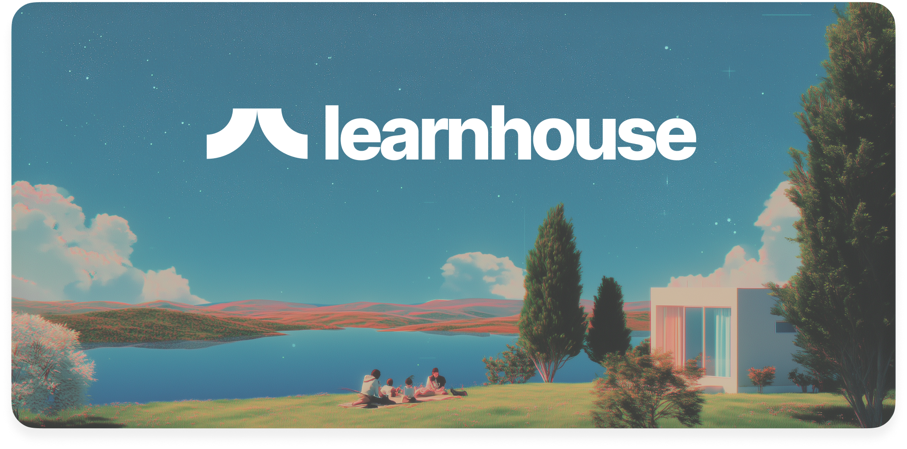

<p align="center">
  <a href="https://learnhouse.app">
    
  </a>
</p>

<h1 align="center">🧠 Adaptive AI Learning Platform</h1>
<h3 align="center">An Intelligent Learning Management System powered by Large Language Models (LLMs), Dynamic Difficulty Adjustment, and the Ebbinghaus Forgetting Curve.</h3>

<p align="center">
  
  
  
  
  
  
  
</p>

---

## 🙏 Special Acknowledgements

> **This project was proudly built on top of the open-source [LearnHouse](https://github.com/learnhouse/learnhouse) platform.**  
> A massive thank you to the LearnHouse team (and Sweave/Badr B.) for providing an incredible foundation featuring powerful block-based editors, WebSockets, and a robust Next.js/FastAPI monorepo. This project extends their world-class platform by injecting advanced AI generation, cognitive science (Ebbinghaus Decay), and dynamic difficulty routing!

---

## 📖 Overview

Adaptive AI Learning Platform is a next-generation Learning Management System (LMS) that delivers personalized education through Artificial Intelligence.

Unlike traditional LMS platforms, this system continuously adapts to each learner by monitoring knowledge retention, dynamically adjusting learning difficulty, generating new assessments using Large Language Models (LLMs), and automatically creating remediation paths whenever a learner struggles.

---

## ✨ Custom Built AI Features

### 📉 Ebbinghaus Knowledge Decay Engine
The platform continuously monitors student retention using the **Ebbinghaus Forgetting Curve**.
- **Midnight retention recalculation** (via APScheduler)
- **Predictive retention analytics** on the Instructor Dashboard
- **Knowledge decay visualization**

### 🔄 Retake (Decayed) Workflow
When a student's retention falls below **80%**:
- The Module is automatically flagged.
- Timeline displays an Amber **Retake (Decayed)** button.
- Gemini generates a completely new, unique assessment on the fly.
- Passing restores retention to 100%. Failing triggers remediation generation.

### 🤖 Dynamic Difficulty Adjustment (DDA)
The platform continuously adapts learning based on student performance.
- **If student fails:** Difficulty decreases. AI creates a Remediation path with simpler real-world explanations.
- **If student passes:** Module is permanently marked as completed. Progress unlocked.

### 🧠 AI Course Generation
- Generate complete learning paths using the Gemini LLM.
- Automatic module and syllabus creation.
- 50-question dynamic assessments evaluated with a strict 80% passing threshold.

---

## 🏗 System Architecture

```text
                Student
                   │
                   ▼
          React + TypeScript
                   │
                   ▼
            FastAPI Backend
                   │
    ┌──────────────┼──────────────┐
    ▼              ▼              ▼
 Gemini LLM   Learning Engine   Analytics
    │              │              │
    ▼              ▼              ▼
Dynamic Quiz   DDA Engine   Retention Engine
    │              │              │
    └──────────────┼──────────────┘
                   ▼
             PostgreSQL Database
```

---

## 🔄 Learning Workflow

```text
Student Selects Course ──▶ AI Generates Course Plan ──▶ Student Studies Module
                                                                 │
                                                                 ▼
Knowledge Retention Tracking ◀── AI Remediation ◀── [Fail] ── Assessment
          │                            │                         │
          ▼                            └──────────────────────[Pass]
Daily Forgetting Curve Analysis
          │
          ▼
    Retention < 80%
          │
          ▼
   Retake (Decayed) ──▶ New AI Generated Assessment
```

---

## 🚀 Getting Started (Self-Host & Dev)

Because this platform is built on LearnHouse, it inherits its incredible CLI for setup!

### Development
```bash
git clone https://github.com/ACUTE02/adaptive-learning-platform.git
cd adaptive-learning-platform
npx learnhouse dev
```
This spins up PostgreSQL and Redis, installs dependencies, and starts the API, Web, and Collab servers with hot reload. *(Note: Ensure you have populated your `.env` files with your Gemini API Keys and Auth variables!)*

---

## 📸 Demo


https://github.com/user-attachments/assets/976b6c1f-62aa-4de9-867c-e81bfe09f697


---

## 👨‍💻 Authors & Credits

- **Ayushmaan Gupta** — B.Tech CSE (Artificial Intelligence & Machine Learning)
- **LearnHouse Framework** — Built upon the open-source platform by Sweave (Badr B.) and team. 

## 📜 License

This project features the MIT License for custom modifications. The core LearnHouse enterprise/open-source features remain under their respective [AGPL-3.0 License](https://github.com/learnhouse/learnhouse/blob/main/LICENSE).

<div align="center">
  <h3><em>"Learning that evolves with every student."</em></h3>
</div>
